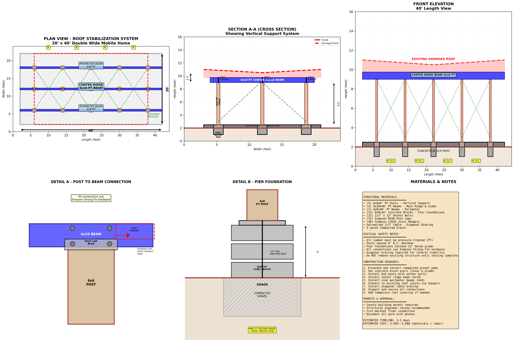

# Mobile Home Roof Stabilization System

## Project Overview

This repository contains plans and documentation for a roof stabilization system designed for a **20' x 40' Double Wide Mobile Home**. The system addresses damaged roof conditions by implementing a comprehensive structural support framework.

## System Description

The roof stabilization system consists of multiple integrated components designed to provide structural support and stability to the existing damaged roof:

### Plan View - Roof Stabilization System
- **Dimensions**: 20' width x 40' length
- **Perimeter Beams**: 4x10 PT (Pressure Treated) beams around the entire perimeter
- **Center Ridge Beam**: 4x10 PT beam running the length of the structure
- **Diagonal Bracing**: Cross-bracing pattern for lateral stability
- **Support Posts**: Multiple 6x6 PT posts positioned throughout the structure

### Section A-A (Cross Section)
Shows the vertical support system:
- **Grade to Roof Height**: Approximately 16 feet
- **4x10 PT Center Ridge Beam**: Installed beneath existing damaged roof
- **Vertical Support Posts**: 6x6 PT posts extending from pier foundations to ridge beam
- **Diagonal Bracing**: Provides lateral stability and load distribution
- **Existing Damaged Roof**: Shown in relation to new support structure

### Front Elevation
- **40' Length View**: Shows complete structural system from front
- **Center Ridge Beam**: 4x10 PT beam visible along the length
- **Concrete Block Piers**: Foundation support system at regular intervals
- **Diagonal Bracing Pattern**: Full cross-bracing visible across elevation

## Structural Materials

### Primary Structural Components
- **(4) 6x6x10' PT Posts** - Main Ridge & Sides
- **(3) 4x10x40' PT Beams** - Main Ridge & Sides
- **(2) 4x10x20' PT Beams** - Perimeter
- **(16) 4x10x10' PT Beams** - Diagonal Bracing and Pier Foundations
- **(15) 1/2" x 12" Anchor Bolts**
- **(15) Simpson BCAP Post Caps**
- **(30) Simpson Strong-Tie Connectors**
- **3 yards Compacted Gravel**

### Foundation Materials
- **Concrete blocks** for pier construction
- **10"DIA Anchor Bolt** embedded in pier
- **8x8x16 Concrete Block**
- **12" min below grade** frost protection
- **Compacted Gravel** base

## Connection Details

### Detail A - Post to Beam Connection
- All connections use **Simpson Strong-Tie hardware**
- **4x10 Beam** with post cap beam connection
- **Post Cap (BCAP)** secures post to beam
- Joist hangers for existing roof joist connections
- Posts spaced at 10' O.C. maximum

### Detail B - Pier Foundation
- **6x6 PT Post** set on anchor bolt
- **10"DIA Anchor Bolt** embedded in concrete
- **8x8x16 Concrete Block** construction
- **12" minimum below grade** for frost protection
- **Compacted Gravel** base for drainage and stability

## Critical Safety Notes

⚠️ **IMPORTANT SAFETY REQUIREMENTS:**

1. All lumber must be **pressure treated (PT)**
2. Posts spaced 8' O.C. maximum
3. All beams must be continuous or properly spliced
4. All connections use **Simpson Strong-Tie hardware**
5. Diagonal bracing required for lateral stability
6. Do not occupy structure until shoring complete

## Construction Sequence

1. **Excavate and install compacted gravel pads**
2. **Install concrete block piers** (12" min below grade)
3. **Set anchor bolts** with epoxy or concrete
4. **Install and plumb all posts**
5. **Install side perimeter beams** (4x4)
6. **Connect to existing roof joists** via hangers
7. **Install diagonal bracing**
8. **Inspect and secure all connections**
9. **Add temporary roof covering** if needed

## Compliance & Requirements

- County building permit required
- Structural engineer review recommended
- Fire marshal final inspection
- Document all work with photos

## Cost Estimate

**Estimated Cost**: $3,500 - $4,500 (materials + labor)

## Project Status

This is a planning and documentation repository for the stabilization project. All work should be performed by qualified contractors in accordance with local building codes and under proper permits.

## Files in this Repository

- `PLANS/stabilization_plans_2d.png` - Main 2D technical drawing (this document)
- `PLANS/stabilization_3d_model.png` - 3D visualization
- `PLANS/mobile_home_stabilization.glb` - 3D model file
- `PLANS/blueprints/` - Additional blueprint views
  - `front.png` - Front view blueprint
  - `side.png` - Side view blueprint
  - `back.png` - Back view blueprint
- `PLANS/foundartion.png` - Foundation detail

## Disclaimer

⚠️ This documentation is for informational purposes only. All construction work must be:
- Approved by local building authorities
- Performed by licensed contractors
- Inspected by qualified structural engineers
- Completed in accordance with local building codes

Always consult with licensed professionals before beginning any structural work.

## License

Please consult with the repository owner regarding usage and licensing of these plans.
